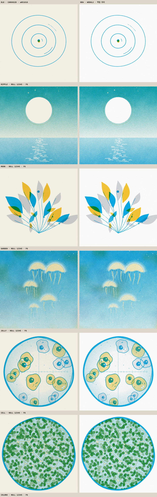
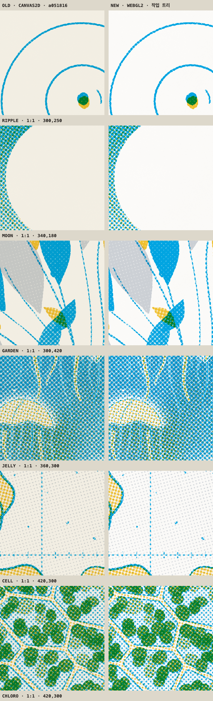

# 인쇄기 비교

2026-09-17에 `bench/`로 잰 값이다. 무엇을 어떻게 재는지는 [bench/README.md](../../README.md)에 있다.

|  | 옛 | 새 |
| --- | --- | --- |
| 인쇄기 | CANVAS2D | WEBGL2 |
| 출처 | 커밋 a051816 feat(press)!: 판형 1080, 화면 크기는 자리가 정한다 | 작업 트리 8519b37 + 커밋하지 않은 변경 |

- GPU: ANGLE (Apple, ANGLE Metal Renderer: Apple M2 Max, Unspecified Version)
- GPU 타이머: 있음
- 브라우저: Mozilla/5.0 (Macintosh; Intel Mac OS X 10_15_7) AppleWebKit/537.36 (KHTML, like Gecko) Claude/2.110.0 Chrome/152.0.7977.76 Safari/537.36
- 논리 코어: 12
- 판화: 두 인쇄기 모두 새 쪽의 판화를 썼다

## 한 장 찍는 시간

1080 한 장. 장마다 한 픽셀을 읽어 GPU가 일을 마칠 때까지 기다렸다. 끓음은 HELD다.

| 판 | 옛 평균 | 새 평균 | 새 99분위 | 빨라진 배 |
| --- | --- | --- | --- | --- |
| RIPPLE | 27.2 ms · 6장 | 1.26 ms · 96장 | 3.2 ms | 22× |
| MOON | 95.77 ms · 6장 | 1.72 ms · 96장 | 2.9 ms | 56× |
| GARDEN | 35.28 ms · 6장 | 1.36 ms · 96장 | 2.2 ms | 26× |
| JELLY | 120.42 ms · 6장 | 3.75 ms · 96장 | 5.1 ms | 32× |
| CELL | 71.85 ms · 6장 | 1.79 ms · 96장 | 2.9 ms | 40× |
| CHLORO | 98.67 ms · 6장 | 6.12 ms · 96장 | 7.3 ms | 16× |

콘택트 시트 한 벌. MOON을 배색 아홉 벌로, 1/3 크기로 찍었다.

|  | 옛 | 새 |
| --- | --- | --- |
| 평균 | 126.45 ms | 13.64 ms |
| 잰 횟수 | 2 | 5 |

## GPU 단계 · 새 인쇄기

판마다 96장의 평균이다. 셰이더는 같은 판을 한 번 더 그려 따로 쟀고, 기다릴 것이 없을 때 한 픽셀 읽는 값을 뺐다. 나머지는 분판을 래스터하고 텍스처로 올리는 몫이다.

| 판 | 판 짜기 | print 호출 | GPU 대기 | 셰이더 | 분판 래스터와 업로드 | 합계 | GPU 타이머 셰이더 |
| --- | --- | --- | --- | --- | --- | --- | --- |
| RIPPLE | 0.03 ms | 0.05 ms | 1.07 ms | 0.41 ms | 0.63 ms | 1.12 ms | 0.1 ms |
| MOON | 0.16 ms | 0.21 ms | 1.48 ms | 0.59 ms | 0.88 ms | 1.69 ms | 0.26 ms |
| GARDEN | 0.09 ms | 0.11 ms | 1.21 ms | 0.45 ms | 0.73 ms | 1.33 ms | 0.14 ms |
| JELLY | 1.35 ms | 1.44 ms | 2.58 ms | 0.84 ms | 1.75 ms | 4.02 ms | 0.5 ms |
| CELL | 0.38 ms | 0.44 ms | 2.29 ms | 1.03 ms | 1.21 ms | 2.73 ms | 0.61 ms |
| CHLORO | 3.59 ms | 3.64 ms | 3.07 ms | 1.23 ms | 1.81 ms | 6.71 ms | 0.74 ms |

## 톤

통 하나를 톤마다 판 전체에 깔고, 종이만 찍은 장으로 나눠 커버리지를 되읽었다. 가장자리 8픽셀은 뺀다.

GRAIN 0, REGISTER 0. 잡음이 망점에 닿지 않으므로 픽셀마다 같아야 한다.

| 톤 | 옛 | 새 | 픽셀 차이 평균 | 픽셀 차이 99분위 |
| --- | --- | --- | --- | --- |
| 0 | 0.0000 | 0.0000 | 0.0000 | 0.0000 |
| 0.05 | 0.0662 | 0.0666 | 0.0005 | 0.0056 |
| 0.1 | 0.1177 | 0.1182 | 0.0007 | 0.0060 |
| 0.2 | 0.2204 | 0.2211 | 0.0009 | 0.0061 |
| 0.3 | 0.3360 | 0.3370 | 0.0012 | 0.0063 |
| 0.4 | 0.4602 | 0.4614 | 0.0014 | 0.0064 |
| 0.5 | 0.6015 | 0.6026 | 0.0014 | 0.0063 |
| 0.6 | 0.7342 | 0.7353 | 0.0013 | 0.0062 |
| 0.7 | 0.8516 | 0.8524 | 0.0010 | 0.0060 |
| 0.8 | 0.9400 | 0.9405 | 0.0006 | 0.0053 |
| 0.9 | 0.9824 | 0.9826 | 0.0002 | 0.0046 |
| 0.95 | 0.9930 | 0.9931 | 0.0001 | 0.0038 |
| 1 | 0.9982 | 0.9982 | 0.0000 | 0.0022 |

기본 GRAIN 0.35. 잡음의 무늬가 다르므로 평균만 본다. 칸마다 옛 값, 새 값, 차이 순이다.

| 톤 | KEY | BODY · REGISTER 2 | WASH | KEY · GRAIN 0.6 · REGISTER 5 |
| --- | --- | --- | --- | --- |
| 0.05 | 0.075 · 0.076 · +0.001 | 0.075 · 0.076 · +0.000 | 0.076 · 0.076 · +0.000 | 0.097 · 0.097 · +0.001 |
| 0.2 | 0.212 · 0.213 · +0.001 | 0.212 · 0.213 · +0.001 | 0.213 · 0.213 · +0.001 | 0.225 · 0.226 · +0.001 |
| 0.4 | 0.415 · 0.416 · +0.002 | 0.415 · 0.416 · +0.002 | 0.416 · 0.416 · +0.000 | 0.397 · 0.399 · +0.002 |
| 0.6 | 0.637 · 0.639 · +0.001 | 0.636 · 0.638 · +0.002 | 0.639 · 0.639 · −0.001 | 0.573 · 0.575 · +0.002 |
| 0.8 | 0.840 · 0.841 · +0.001 | 0.839 · 0.840 · +0.001 | 0.844 · 0.841 · −0.003 | 0.741 · 0.742 · +0.001 |
| 0.95 | 0.941 · 0.941 · +0.000 | 0.940 · 0.940 · +0.001 | 0.946 · 0.942 · −0.005 | 0.849 · 0.849 · +0.001 |
| 1 | 0.962 · 0.963 · +0.000 | 0.961 · 0.962 · +0.000 | 0.968 · 0.963 · −0.005 | 0.880 · 0.880 · +0.001 |

## 판마다

같은 롤, 프레임 6. 블록은 망점 셀 셋 너비(27픽셀)이고 차이는 8비트 단계다.

| 판 | 옛 평균 색 | 새 평균 색 | 블록 차이 평균 | 99분위 | 최대 |
| --- | --- | --- | --- | --- | --- |
| RIPPLE | 237.5 / 236.5 / 226.5 | 246.0 / 248.2 / 247.2 | 13.68 | 21.28 | 21.53 |
| MOON | 129.7 / 193.9 / 197.2 | 133.7 / 203.2 / 215.0 | 11.06 | 21.13 | 23.16 |
| GARDEN | 219.3 / 225.1 / 210.4 | 227.2 / 236.2 / 229.7 | 12.84 | 21.25 | 21.53 |
| JELLY | 115.0 / 185.4 / 199.1 | 118.9 / 194.4 / 217.2 | 11 | 20.92 | 21.95 |
| CELL | 203.5 / 219.2 / 208.3 | 210.7 / 229.9 / 227.4 | 12.45 | 21.2 | 22.99 |
| CHLORO | 151.4 / 195.0 / 171.2 | 156.6 / 204.5 / 186.7 | 10.49 | 21.12 | 22 |
| POSTER | 223.1 / 220.9 / 192.2 | 231.1 / 231.7 / 209.7 | 12.11 | 21.27 | 21.53 |
| MEDIUM | 196.7 / 208.5 / 178.1 | 203.8 / 218.8 / 194.3 | 11.36 | 21.22 | 21.8 |

블록 차이만 조건별로. GRAIN이 0이면 잡음이 빠지므로 남는 차이가 망점 계산의 차이다.

| 판 | GRAIN 0 · REGISTER 0 | GRAIN 0 · REGISTER 2 | 기본 · 1/3 크기 |
| --- | --- | --- | --- |
| RIPPLE | 평균 13.7 · 최대 21.53 | 평균 13.66 · 최대 21.53 | 평균 13.54 · 최대 21.84 |
| MOON | 평균 10.4 · 최대 21.39 | 평균 10.37 · 최대 21.39 | 평균 10.88 · 최대 25.88 |
| GARDEN | 평균 12.74 · 최대 21.53 | 평균 12.71 · 최대 21.53 | 평균 12.71 · 최대 21.84 |
| JELLY | 평균 10.09 · 최대 20.45 | 평균 10.05 · 최대 20.41 | 평균 10.76 · 최대 24.31 |
| CELL | 평균 12.3 · 최대 21.43 | 평균 12.26 · 최대 21.43 | 평균 11.96 · 최대 23.96 |
| CHLORO | 평균 9.83 · 최대 21.43 | 평균 9.76 · 최대 21.43 | 평균 9.93 · 최대 25.56 |
| POSTER | 평균 12.12 · 최대 21.53 | 평균 12.05 · 최대 21.53 | — |
| MEDIUM | 평균 10.99 · 최대 21.53 | 평균 10.92 · 최대 21.53 | — |

1/3 크기의 평균 색.

| 판 | 옛 | 새 |
| --- | --- | --- |
| RIPPLE | 237.6 / 236.5 / 226.4 | 245.7 / 248.1 / 247.2 |
| MOON | 126.8 / 189.7 / 186.4 | 131.6 / 199.2 / 203.6 |
| GARDEN | 221.4 / 226.3 / 212.2 | 228.8 / 237.3 / 231.5 |
| JELLY | 111.8 / 181.3 / 191.6 | 116.2 / 190.5 / 209.0 |
| CELL | 196.6 / 215.3 / 205.8 | 203.0 / 225.7 / 224.4 |
| CHLORO | 151.3 / 193.5 / 171.6 | 156.1 / 202.7 / 186.2 |

## 종이결

|  | 평균 색 | 빨강 채널 표준편차 |
| --- | --- | --- |
| 옛 | 242.3 / 238.2 / 227.0 | 0.61 |
| 새 | 251.0 / 250.0 / 247.8 | 0.7 |

## 이음매

초당 여덟 장. 이웃 프레임의 차이를 한 바퀴 재고 마지막 걸음의 z를 씨앗마다 적었다. 두 인쇄기의 값이 씨앗마다 같으면 이음매는 판화의 것이고 인쇄기와 무관하다.

| 판 | 끓음 | 옛 | 새 |
| --- | --- | --- | --- |
| RIPPLE | HELD | -1.44 -1.63 -1.66 -1.98 -1.8 -1.65 | -1.41 -1.59 -1.67 -1.93 -1.8 -1.66 |
| RIPPLE | TWOS | -1.46 -1.6 -1.71 | -1.41 -1.67 -1.69 |
| MOON | HELD | 1.04 0.96 1.05 1.25 1.21 1.14 | 1.04 0.99 1.1 1.13 1.34 1.11 |
| MOON | TWOS | -0.31 -0.74 -0.97 | -0.19 -0.51 -0.95 |
| GARDEN | HELD | 1.59 0.8 1.44 1.12 1.87 0.39 | 1.65 0.66 1.45 0.83 1.88 0.34 |
| GARDEN | TWOS | 0.68 -0.01 0.45 | 1.09 0.07 0.65 |
| JELLY | HELD | -2.06 -2.43 0.34 0.52 -2.86 -3.44 | -2.05 -2.59 0.47 0.66 -2.77 -3.58 |
| JELLY | TWOS | -0.4 -0.65 -1.13 | -0.19 -0.4 -1.17 |
| CELL | HELD | 1.41 2.05 2.04 -0.56 -0.18 1.53 | 1.42 2.03 1.99 -0.56 -0.18 1.51 |
| CELL | TWOS | -0.1 -0.18 -0.63 | 0.11 0.02 -0.61 |
| CHLORO | HELD | 0.06 0.08 0.04 1.4 1.3 -1.69 | 0.09 0.09 0.04 1.47 1.35 -1.71 |
| CHLORO | TWOS | -0.13 -0.49 -0.58 | -0.02 -0.26 -0.51 |

## 그림

같은 롤, 같은 프레임. 왼쪽이 옛 인쇄기다.

