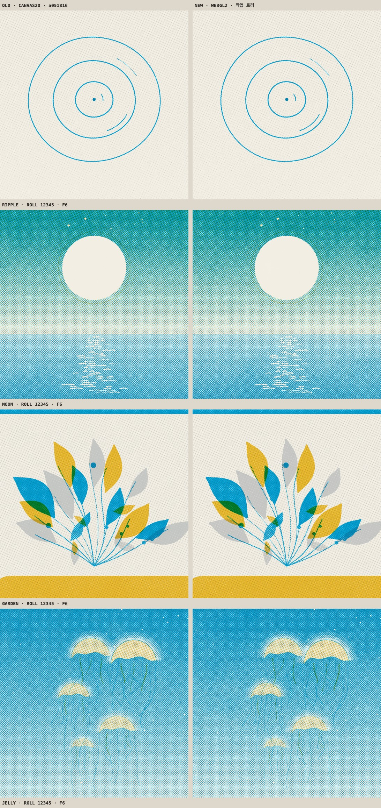
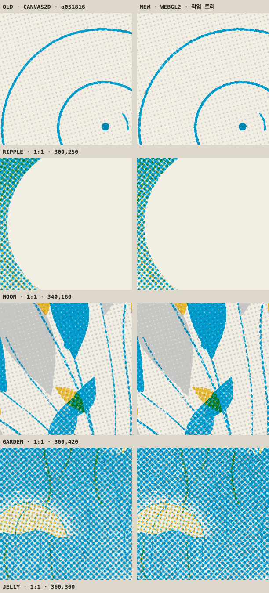

# 인쇄기 비교

2026-09-17에 `bench/`로 잰 값이다. 무엇을 어떻게 재는지는 [bench/README.md](../../README.md)에 있다.

|  | 옛 | 새 |
| --- | --- | --- |
| 인쇄기 | CANVAS2D | WEBGL2 |
| 출처 | 커밋 a051816 feat(press)!: 판형 1080, 화면 크기는 자리가 정한다 | 작업 트리 a051816 + 커밋하지 않은 변경 |

- GPU: ANGLE (Apple, ANGLE Metal Renderer: Apple M2 Max, Unspecified Version)
- GPU 타이머: 있음
- 브라우저: Mozilla/5.0 (Macintosh; Intel Mac OS X 10_15_7) AppleWebKit/537.36 (KHTML, like Gecko) Claude/2.110.0 Chrome/152.0.7977.76 Safari/537.36
- 논리 코어: 12

## 한 장 찍는 시간

1080 한 장. 장마다 한 픽셀을 읽어 GPU가 일을 마칠 때까지 기다렸다. 끓음은 HELD다.

| 판 | 옛 평균 | 새 평균 | 새 99분위 | 빨라진 배 |
| --- | --- | --- | --- | --- |
| RIPPLE | 59 ms · 6장 | 1.4 ms · 96장 | 4 ms | 42× |
| MOON | 95.45 ms · 6장 | 1.71 ms · 96장 | 2.9 ms | 56× |
| GARDEN | 71.02 ms · 6장 | 1.53 ms · 96장 | 2.9 ms | 46× |
| JELLY | 106.05 ms · 6장 | 2.4 ms · 96장 | 3.3 ms | 44× |

콘택트 시트 한 벌. MOON을 배색 아홉 벌로, 1/3 크기로 찍었다.

|  | 옛 | 새 |
| --- | --- | --- |
| 평균 | 123.4 ms | 13.56 ms |
| 잰 횟수 | 2 | 5 |

## GPU 단계 · 새 인쇄기

판마다 96장의 평균이다. 셰이더는 같은 판을 한 번 더 그려 따로 쟀고, 기다릴 것이 없을 때 한 픽셀 읽는 값을 뺐다. 나머지는 분판을 래스터하고 텍스처로 올리는 몫이다.

| 판 | 판 짜기 | print 호출 | GPU 대기 | 셰이더 | 분판 래스터와 업로드 | 합계 | GPU 타이머 셰이더 |
| --- | --- | --- | --- | --- | --- | --- | --- |
| RIPPLE | 0.03 ms | 0.05 ms | 1.13 ms | 0.49 ms | 0.6 ms | 1.19 ms | 0.18 ms |
| MOON | 0.17 ms | 0.21 ms | 1.46 ms | 0.58 ms | 0.86 ms | 1.68 ms | 0.26 ms |
| GARDEN | 0.08 ms | 0.11 ms | 1.34 ms | 0.53 ms | 0.77 ms | 1.45 ms | 0.23 ms |
| JELLY | 0.59 ms | 0.63 ms | 1.75 ms | 0.6 ms | 1.12 ms | 2.38 ms | 0.28 ms |

## 톤

통 하나를 톤마다 판 전체에 깔고, 종이만 찍은 장으로 나눠 커버리지를 되읽었다. 가장자리 8픽셀은 뺀다.

GRAIN 0, REGISTER 0. 잡음이 망점에 닿지 않으므로 픽셀마다 같아야 한다.

| 톤 | 옛 | 새 | 픽셀 차이 평균 | 픽셀 차이 99분위 |
| --- | --- | --- | --- | --- |
| 0 | 0.0000 | 0.0000 | 0.0000 | 0.0000 |
| 0.05 | 0.0662 | 0.0666 | 0.0005 | 0.0050 |
| 0.1 | 0.1177 | 0.1182 | 0.0006 | 0.0055 |
| 0.2 | 0.2204 | 0.2212 | 0.0009 | 0.0058 |
| 0.3 | 0.3360 | 0.3370 | 0.0011 | 0.0061 |
| 0.4 | 0.4602 | 0.4614 | 0.0013 | 0.0063 |
| 0.5 | 0.6015 | 0.6027 | 0.0014 | 0.0062 |
| 0.6 | 0.7342 | 0.7353 | 0.0012 | 0.0061 |
| 0.7 | 0.8516 | 0.8524 | 0.0010 | 0.0055 |
| 0.8 | 0.9400 | 0.9405 | 0.0005 | 0.0049 |
| 0.9 | 0.9824 | 0.9826 | 0.0002 | 0.0041 |
| 0.95 | 0.9930 | 0.9931 | 0.0001 | 0.0041 |
| 1 | 0.9982 | 0.9982 | 0.0000 | 0.0009 |

기본 GRAIN 0.35. 잡음의 무늬가 다르므로 평균만 본다. 칸마다 옛 값, 새 값, 차이 순이다.

| 톤 | KEY | BODY · REGISTER 2 | WASH | KEY · GRAIN 0.6 · REGISTER 5 |
| --- | --- | --- | --- | --- |
| 0.05 | 0.075 · 0.076 · +0.001 | 0.075 · 0.076 · +0.000 | 0.076 · 0.076 · +0.001 | 0.097 · 0.097 · +0.001 |
| 0.2 | 0.212 · 0.213 · +0.001 | 0.212 · 0.213 · +0.001 | 0.213 · 0.214 · +0.001 | 0.225 · 0.226 · +0.001 |
| 0.4 | 0.415 · 0.416 · +0.002 | 0.415 · 0.416 · +0.002 | 0.416 · 0.417 · +0.000 | 0.397 · 0.399 · +0.002 |
| 0.6 | 0.637 · 0.639 · +0.002 | 0.636 · 0.638 · +0.002 | 0.639 · 0.639 · −0.000 | 0.573 · 0.575 · +0.002 |
| 0.8 | 0.840 · 0.841 · +0.001 | 0.839 · 0.840 · +0.001 | 0.844 · 0.842 · −0.002 | 0.741 · 0.742 · +0.001 |
| 0.95 | 0.941 · 0.941 · +0.000 | 0.940 · 0.940 · +0.000 | 0.946 · 0.942 · −0.004 | 0.849 · 0.849 · +0.001 |
| 1 | 0.962 · 0.963 · +0.000 | 0.961 · 0.961 · +0.000 | 0.968 · 0.964 · −0.005 | 0.880 · 0.880 · +0.001 |

## 판마다

같은 롤, 프레임 6. 블록은 망점 셀 셋 너비(27픽셀)이고 차이는 8비트 단계다.

| 판 | 옛 평균 색 | 새 평균 색 | 블록 차이 평균 | 99분위 | 최대 |
| --- | --- | --- | --- | --- | --- |
| RIPPLE | 233.8 / 233.2 / 223.9 | 233.8 / 233.2 / 223.8 | 0.34 | 1.63 | 4.44 |
| MOON | 129.7 / 193.9 / 197.2 | 129.0 / 193.6 / 196.9 | 2.1 | 11.67 | 23.58 |
| GARDEN | 207.0 / 212.0 / 185.6 | 206.9 / 211.9 / 185.4 | 0.73 | 5.07 | 11.35 |
| JELLY | 114.4 / 188.4 / 206.4 | 114.1 / 188.3 / 206.4 | 2.19 | 12.15 | 22.92 |
| POSTER | 223.1 / 220.9 / 192.2 | 223.0 / 220.8 / 192.0 | 0.5 | 4.37 | 10.62 |
| MEDIUM | 196.7 / 208.5 / 178.1 | 196.7 / 208.5 / 177.9 | 1.03 | 7.59 | 20.27 |

블록 차이만 조건별로. GRAIN이 0이면 잡음이 빠지므로 남는 차이가 망점 계산의 차이다.

| 판 | GRAIN 0 · REGISTER 0 | GRAIN 0 · REGISTER 2 | 기본 · 1/3 크기 |
| --- | --- | --- | --- |
| RIPPLE | 평균 0.18 · 최대 0.84 | 평균 0.2 · 최대 1.84 | 평균 0.63 · 최대 13.59 |
| MOON | 평균 0.18 · 최대 0.8 | 평균 0.22 · 최대 1.8 | 평균 2.43 · 최대 19.88 |
| GARDEN | 평균 0.17 · 최대 0.89 | 평균 0.22 · 최대 1.87 | 평균 1.25 · 최대 14.89 |
| JELLY | 평균 0.17 · 최대 0.79 | 평균 0.21 · 최대 1.61 | 평균 2.26 · 최대 21.89 |
| POSTER | 평균 0.19 · 최대 1 | 평균 0.25 · 최대 2.98 | — |
| MEDIUM | 평균 0.19 · 최대 0.99 | 평균 0.27 · 최대 2.99 | — |

1/3 크기의 평균 색.

| 판 | 옛 | 새 |
| --- | --- | --- |
| RIPPLE | 229.5 / 229.3 / 220.7 | 229.0 / 229.2 / 220.7 |
| MOON | 126.8 / 189.7 / 186.4 | 127.0 / 189.8 / 186.4 |
| GARDEN | 205.8 / 210.4 / 186.7 | 205.0 / 210.2 / 186.6 |
| JELLY | 111.6 / 185.0 / 202.7 | 112.0 / 185.1 / 202.7 |

## 종이결

|  | 평균 색 | 빨강 채널 표준편차 |
| --- | --- | --- |
| 옛 | 242.3 / 238.2 / 227.0 | 0.61 |
| 새 | 242.3 / 238.2 / 227.0 | 0.55 |

## 이음매

초당 여덟 장. 이웃 프레임의 차이를 한 바퀴 재고 마지막 걸음의 z를 씨앗마다 적었다. 두 인쇄기의 값이 씨앗마다 같으면 이음매는 판화의 것이고 인쇄기와 무관하다.

| 판 | 끓음 | 옛 | 새 |
| --- | --- | --- | --- |
| RIPPLE | HELD | -1.49 -1.62 -1.64 -2.05 -1.78 -1.68 | -1.45 -1.63 -1.63 -2 -1.81 -1.69 |
| RIPPLE | TWOS | -1.48 -1.61 -1.68 | -1.43 -1.69 -1.69 |
| MOON | HELD | 1.04 0.96 1.05 1.25 1.21 1.14 | 1.04 0.99 1.1 1.14 1.34 1.11 |
| MOON | TWOS | -0.31 -0.74 -0.97 | -0.18 -0.53 -0.97 |
| GARDEN | HELD | 1.63 0.83 1.48 1.19 1.91 0.45 | 1.69 0.67 1.48 0.85 1.92 0.39 |
| GARDEN | TWOS | 0.63 -0.05 0.4 | 0.88 0.23 0.25 |
| JELLY | HELD | -1.62 -2.74 0.04 0.65 -2.51 -3.22 | -1.66 -2.82 0.13 0.8 -2.36 -3.16 |
| JELLY | TWOS | -0.4 -1.05 -1.31 | -0.16 -0.88 -1.41 |

## 그림

같은 롤, 같은 프레임. 왼쪽이 옛 인쇄기다.

