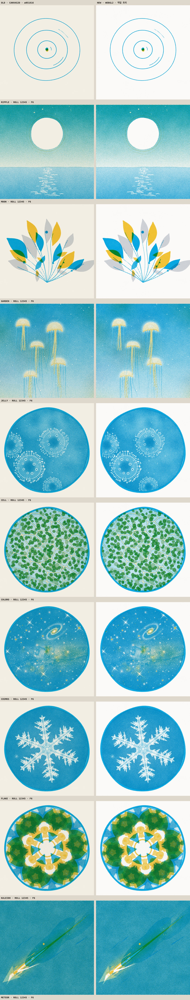
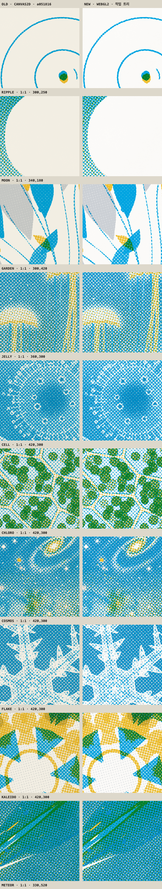

# 인쇄기 비교

2026-09-18에 `bench/`로 잰 값이다. 무엇을 어떻게 재는지는 [bench/README.md](../../README.md)에 있다.

|  | 옛 | 새 |
| --- | --- | --- |
| 인쇄기 | CANVAS2D | WEBGL2 |
| 출처 | 커밋 a051816 feat(press)!: 판형 1080, 화면 크기는 자리가 정한다 | 작업 트리 6ca9b94 + 커밋하지 않은 변경 |

- GPU: ANGLE (Apple, ANGLE Metal Renderer: Apple M2 Max, Unspecified Version)
- GPU 타이머: 있음
- 브라우저: Mozilla/5.0 (Macintosh; Intel Mac OS X 10_15_7) AppleWebKit/537.36 (KHTML, like Gecko) Claude/2.2553.0 Chrome/152.0.7977.76 Safari/537.36
- 논리 코어: 12
- 판화: 두 인쇄기 모두 새 쪽의 판화를 썼다

## 한 장 찍는 시간

1080 한 장. 장마다 한 픽셀을 읽어 GPU가 일을 마칠 때까지 기다렸다. 끓음은 HELD다.

| 판 | 옛 평균 | 새 평균 | 새 99분위 | 빨라진 배 |
| --- | --- | --- | --- | --- |
| RIPPLE | 29.05 ms · 6장 | 1.29 ms · 96장 | 3.4 ms | 23× |
| MOON | 97.7 ms · 6장 | 1.9 ms · 96장 | 2.8 ms | 51× |
| GARDEN | 37.1 ms · 6장 | 1.48 ms · 96장 | 3.5 ms | 25× |
| JELLY | 134.05 ms · 6장 | 6.78 ms · 96장 | 9.1 ms | 20× |
| CELL | 80.05 ms · 6장 | 2.55 ms · 96장 | 4.1 ms | 31× |
| CHLORO | 96.25 ms · 6장 | 5.61 ms · 96장 | 7.7 ms | 17× |
| COSMOS | 88.52 ms · 6장 | 3.04 ms · 96장 | 5.8 ms | 29× |
| FLAKE | 76.05 ms · 6장 | 4.03 ms · 96장 | 6.6 ms | 19× |
| KALEIDO | 87.82 ms · 6장 | 1.93 ms · 96장 | 4.7 ms | 46× |
| METEOR | 141.58 ms · 6장 | 2.5 ms · 96장 | 3.5 ms | 57× |

콘택트 시트 한 벌. MOON을 배색 아홉 벌로, 1/3 크기로 찍었다.

|  | 옛 | 새 |
| --- | --- | --- |
| 평균 | 145.8 ms | 14.98 ms |
| 잰 횟수 | 2 | 5 |

## GPU 단계 · 새 인쇄기

판마다 96장의 평균이다. 셰이더는 같은 판을 한 번 더 그려 따로 쟀고, 기다릴 것이 없을 때 한 픽셀 읽는 값을 뺐다. 나머지는 분판을 래스터하고 텍스처로 올리는 몫이다.

| 판 | 판 짜기 | print 호출 | GPU 대기 | 셰이더 | 분판 래스터와 업로드 | 합계 | GPU 타이머 셰이더 |
| --- | --- | --- | --- | --- | --- | --- | --- |
| RIPPLE | 0.03 ms | 0.06 ms | 1.16 ms | 0.44 ms | 0.69 ms | 1.23 ms | 0.11 ms |
| MOON | 0.21 ms | 0.26 ms | 1.55 ms | 0.6 ms | 0.93 ms | 1.81 ms | 0.26 ms |
| GARDEN | 0.07 ms | 0.12 ms | 1.24 ms | 0.46 ms | 0.76 ms | 1.35 ms | 0.14 ms |
| JELLY | 2.74 ms | 3.04 ms | 3.24 ms | 1.01 ms | 2.42 ms | 6.28 ms | 0.7 ms |
| CELL | 0.49 ms | 0.55 ms | 1.88 ms | 0.53 ms | 1.34 ms | 2.44 ms | 0.23 ms |
| CHLORO | 2.85 ms | 2.91 ms | 2.36 ms | 0.82 ms | 1.52 ms | 5.27 ms | 0.45 ms |
| COSMOS | 1.02 ms | 1.09 ms | 1.85 ms | 0.59 ms | 1.25 ms | 2.94 ms | 0.26 ms |
| FLAKE | 1.88 ms | 1.92 ms | 1.9 ms | 0.74 ms | 1.14 ms | 3.83 ms | 0.36 ms |
| KALEIDO | 0.15 ms | 0.2 ms | 1.63 ms | 0.61 ms | 0.99 ms | 1.83 ms | 0.3 ms |
| METEOR | 0.32 ms | 0.4 ms | 1.82 ms | 0.74 ms | 1.12 ms | 2.22 ms | 0.38 ms |

## 톤

통 하나를 톤마다 판 전체에 깔고, 종이만 찍은 장으로 나눠 커버리지를 되읽었다. 가장자리 8픽셀은 뺀다.

GRAIN 0, REGISTER 0. 잡음이 망점에 닿지 않으므로 픽셀마다 같아야 한다.

| 톤 | 옛 | 새 | 픽셀 차이 평균 | 픽셀 차이 99분위 |
| --- | --- | --- | --- | --- |
| 0 | 0.0000 | 0.0000 | 0.0000 | 0.0000 |
| 0.05 | 0.0662 | 0.0666 | 0.0005 | 0.0056 |
| 0.1 | 0.1177 | 0.1182 | 0.0007 | 0.0060 |
| 0.2 | 0.2204 | 0.2211 | 0.0009 | 0.0061 |
| 0.3 | 0.3360 | 0.3370 | 0.0012 | 0.0063 |
| 0.4 | 0.4602 | 0.4614 | 0.0014 | 0.0064 |
| 0.5 | 0.6015 | 0.6026 | 0.0014 | 0.0063 |
| 0.6 | 0.7342 | 0.7353 | 0.0013 | 0.0062 |
| 0.7 | 0.8516 | 0.8524 | 0.0010 | 0.0060 |
| 0.8 | 0.9400 | 0.9405 | 0.0006 | 0.0053 |
| 0.9 | 0.9824 | 0.9826 | 0.0002 | 0.0046 |
| 0.95 | 0.9930 | 0.9931 | 0.0001 | 0.0038 |
| 1 | 0.9982 | 0.9982 | 0.0000 | 0.0022 |

기본 GRAIN 0.35. 잡음의 무늬가 다르므로 평균만 본다. 칸마다 옛 값, 새 값, 차이 순이다.

| 톤 | KEY | BODY · REGISTER 2 | WASH | KEY · GRAIN 0.6 · REGISTER 5 |
| --- | --- | --- | --- | --- |
| 0.05 | 0.075 · 0.076 · +0.001 | 0.075 · 0.076 · +0.000 | 0.076 · 0.076 · +0.000 | 0.097 · 0.097 · +0.001 |
| 0.2 | 0.212 · 0.213 · +0.001 | 0.212 · 0.213 · +0.001 | 0.213 · 0.213 · +0.001 | 0.225 · 0.226 · +0.001 |
| 0.4 | 0.415 · 0.416 · +0.002 | 0.415 · 0.416 · +0.002 | 0.416 · 0.416 · +0.000 | 0.397 · 0.399 · +0.002 |
| 0.6 | 0.637 · 0.639 · +0.001 | 0.636 · 0.638 · +0.002 | 0.639 · 0.639 · −0.001 | 0.573 · 0.575 · +0.002 |
| 0.8 | 0.840 · 0.841 · +0.001 | 0.839 · 0.840 · +0.001 | 0.844 · 0.841 · −0.003 | 0.741 · 0.742 · +0.001 |
| 0.95 | 0.941 · 0.941 · +0.000 | 0.940 · 0.940 · +0.001 | 0.946 · 0.942 · −0.005 | 0.849 · 0.849 · +0.001 |
| 1 | 0.962 · 0.963 · +0.000 | 0.961 · 0.962 · +0.000 | 0.968 · 0.963 · −0.005 | 0.880 · 0.880 · +0.001 |

## 판마다

같은 롤, 프레임 6. 블록은 망점 셀 셋 너비(27픽셀)이고 차이는 8비트 단계다.

| 판 | 옛 평균 색 | 새 평균 색 | 블록 차이 평균 | 99분위 | 최대 |
| --- | --- | --- | --- | --- | --- |
| RIPPLE | 237.5 / 236.5 / 226.5 | 246.0 / 248.2 / 247.2 | 13.68 | 21.28 | 21.53 |
| MOON | 128.8 / 193.6 / 196.9 | 132.8 / 202.8 / 214.6 | 11.03 | 21.13 | 23.11 |
| GARDEN | 219.3 / 225.1 / 210.4 | 227.2 / 236.2 / 229.7 | 12.85 | 21.25 | 21.53 |
| JELLY | 112.6 / 183.7 / 195.7 | 116.5 / 192.7 / 213.8 | 10.98 | 21.69 | 23.31 |
| CELL | 126.4 / 192.2 / 209.3 | 131.0 / 201.7 / 228.5 | 11.73 | 21.16 | 22.27 |
| CHLORO | 155.4 / 196.9 / 175.0 | 160.9 / 206.6 / 190.9 | 10.75 | 21.15 | 22.7 |
| COSMOS | 119.0 / 185.2 / 199.8 | 123.4 / 194.4 / 218.2 | 11.26 | 21.15 | 21.6 |
| FLAKE | 130.4 / 190.8 / 206.6 | 135.0 / 200.2 / 225.5 | 11.54 | 21.15 | 21.43 |
| KALEIDO | 151.0 / 188.1 / 156.0 | 156.4 / 197.4 / 170.3 | 10.08 | 21.16 | 21.81 |
| METEOR | 40.9 / 147.1 / 160.9 | 42.2 / 154.3 / 175.5 | 8.93 | 19.61 | 22.71 |
| POSTER | 223.1 / 220.9 / 192.2 | 231.1 / 231.7 / 209.7 | 12.11 | 21.27 | 21.53 |
| MEDIUM | 196.7 / 208.5 / 178.1 | 203.8 / 218.8 / 194.3 | 11.36 | 21.23 | 21.8 |

블록 차이만 조건별로. GRAIN이 0이면 잡음이 빠지므로 남는 차이가 망점 계산의 차이다.

| 판 | GRAIN 0 · REGISTER 0 | GRAIN 0 · REGISTER 2 | 기본 · 1/3 크기 |
| --- | --- | --- | --- |
| RIPPLE | 평균 13.7 · 최대 21.53 | 평균 13.66 · 최대 21.53 | 평균 13.61 · 최대 21.84 |
| MOON | 평균 10.37 · 최대 21.39 | 평균 10.35 · 최대 21.39 | 평균 11.63 · 최대 38.78 |
| GARDEN | 평균 12.74 · 최대 21.53 | 평균 12.71 · 최대 21.53 | 평균 12.85 · 최대 21.84 |
| JELLY | 평균 9.99 · 최대 21.85 | 평균 9.97 · 최대 21.77 | 평균 13.96 · 최대 40.17 |
| CELL | 평균 10.74 · 최대 21.43 | 평균 10.71 · 최대 21.43 | 평균 11.85 · 최대 25.62 |
| CHLORO | 평균 10.06 · 최대 21.43 | 평균 10 · 최대 21.43 | 평균 10.75 · 최대 25.69 |
| COSMOS | 평균 10.27 · 최대 21.43 | 평균 10.24 · 최대 21.43 | 평균 12.3 · 최대 39.65 |
| FLAKE | 평균 10.75 · 최대 21.43 | 평균 10.71 · 최대 21.43 | 평균 11.77 · 최대 25.02 |
| KALEIDO | 평균 9.26 · 최대 21.43 | 평균 9.24 · 최대 21.43 | 평균 10.54 · 최대 25.16 |
| METEOR | 평균 7.16 · 최대 19.77 | 평균 7.13 · 최대 19.97 | 평균 9.06 · 최대 26.23 |
| POSTER | 평균 12.12 · 최대 21.53 | 평균 12.05 · 최대 21.53 | — |
| MEDIUM | 평균 10.99 · 최대 21.53 | 평균 10.92 · 최대 21.53 | — |

1/3 크기의 평균 색.

| 판 | 옛 | 새 |
| --- | --- | --- |
| RIPPLE | 237.6 / 236.5 / 226.4 | 245.9 / 248.2 / 247.2 |
| MOON | 126.2 / 189.4 / 186.0 | 131.1 / 199.4 / 204.8 |
| GARDEN | 221.4 / 226.3 / 212.2 | 229.1 / 237.5 / 231.6 |
| JELLY | 110.1 / 178.9 / 184.2 | 115.6 / 190.1 / 208.2 |
| CELL | 135.8 / 194.9 / 209.6 | 140.9 / 204.8 / 229.0 |
| CHLORO | 156.0 / 195.8 / 175.4 | 161.6 / 205.5 / 191.4 |
| COSMOS | 130.2 / 188.8 / 197.6 | 135.2 / 198.8 / 218.1 |
| FLAKE | 139.3 / 194.6 / 208.2 | 144.4 / 204.3 / 227.4 |
| KALEIDO | 157.3 / 191.0 / 162.2 | 163.2 / 200.6 / 177.3 |
| METEOR | 61.9 / 151.6 / 148.3 | 65.0 / 159.6 / 162.3 |

## 종이결

|  | 평균 색 | 빨강 채널 표준편차 |
| --- | --- | --- |
| 옛 | 242.3 / 238.2 / 227.0 | 0.61 |
| 새 | 251.0 / 250.0 / 247.8 | 0.7 |

## 이음매

초당 여덟 장. 이웃 프레임의 차이를 한 바퀴 재고 마지막 걸음의 z를 씨앗마다 적었다. 두 인쇄기의 값이 씨앗마다 같으면 이음매는 판화의 것이고 인쇄기와 무관하다.

| 판 | 끓음 | 옛 | 새 |
| --- | --- | --- | --- |
| RIPPLE | HELD | -1.44 -1.63 -1.66 -1.98 -1.8 -1.65 | -1.41 -1.59 -1.67 -1.93 -1.8 -1.66 |
| RIPPLE | TWOS | -1.46 -1.6 -1.71 | -1.41 -1.67 -1.69 |
| MOON | HELD | 1.05 0.99 1.07 1.26 1.24 1.21 | 1.08 0.98 1.09 1.15 1.37 1.14 |
| MOON | TWOS | -0.31 -0.73 -0.96 | -0.19 -0.5 -0.94 |
| GARDEN | HELD | 1.59 0.8 1.44 1.12 1.87 0.39 | 1.65 0.66 1.46 0.85 1.88 0.34 |
| GARDEN | TWOS | 0.68 -0.01 0.45 | 1.09 0.07 0.65 |
| JELLY | HELD | 1.41 -1.02 0.65 -1 1.11 -0.55 | 1.19 -1.06 0.67 -1.02 1.17 -0.46 |
| JELLY | TWOS | -0.34 -0.57 -1.07 | -0.14 -0.32 -1.08 |
| CELL | HELD | -0.5 -3.93 -0.88 0.19 0.05 -0.72 | -0.52 -3.9 -0.94 0.2 0.03 -0.72 |
| CELL | TWOS | -0.49 -1.36 -1.49 | -0.14 -1.14 -1.74 |
| CHLORO | HELD | 0.96 -0.33 -1.51 0.16 0.95 0.1 | 1.02 -0.31 -1.54 0.19 0.9 0 |
| CHLORO | TWOS | -0.3 -0.66 -0.89 | -0.21 -0.41 -0.79 |
| COSMOS | HELD | 1.82 0.4 0.95 0.82 0.63 -1.03 | 2.15 0.6 0.5 0.79 0.44 -1.04 |
| COSMOS | TWOS | -0.35 -0.9 -1.26 | -0.11 -0.62 -1.48 |
| FLAKE | HELD | 1.08 0.17 0.14 -0.6 -0.62 -1.07 | 0.91 0.09 0.03 -0.65 -0.6 -0.98 |
| FLAKE | TWOS | -0.38 -1.12 -1.44 | -0.08 -0.89 -1.69 |
| KALEIDO | HELD | 0.15 1.2 0.02 -0.34 0.9 1.5 | 0.16 1.2 0.12 -0.42 0.88 1.5 |
| KALEIDO | TWOS | -0.28 -0.32 -0.94 | -0.16 -0.03 -0.93 |
| METEOR | HELD | -0.37 -0.11 -0.23 -0.3 -0.29 -0.26 | -0.37 -0.11 -0.23 -0.3 -0.29 -0.26 |
| METEOR | TWOS | -0.51 -0.24 -0.78 | -0.39 0.05 -0.79 |

## 그림

같은 롤, 같은 프레임. 왼쪽이 옛 인쇄기다.

